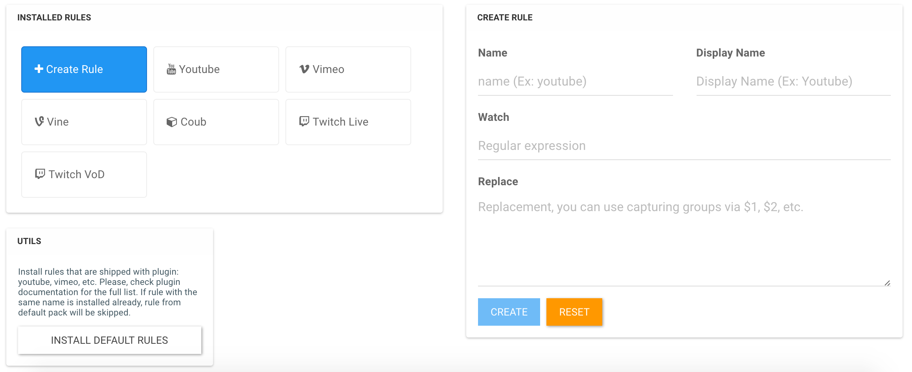

# NodeBB Embed

Embed media and rich content in posts: youtube, vimeo, twitch etc. All embeds are based on the rules. You are encouraged to build your own rules to embed everything what is embeddable.

<!-- START doctoc generated TOC please keep comment here to allow auto update -->
<!-- DON'T EDIT THIS SECTION, INSTEAD RE-RUN doctoc TO UPDATE -->
 

<!-- END doctoc generated TOC please keep comment here to allow auto update -->

Plugin works well with default `Markdown` plugin or without him, i.e. there is no alteration of links in user's posts.

## Embeds Supported by Default

Most embeds are responsive with limited width to `640px`

- Coub
- Vimeo
- Vine
- Youtube (short and general urls)

## Look

